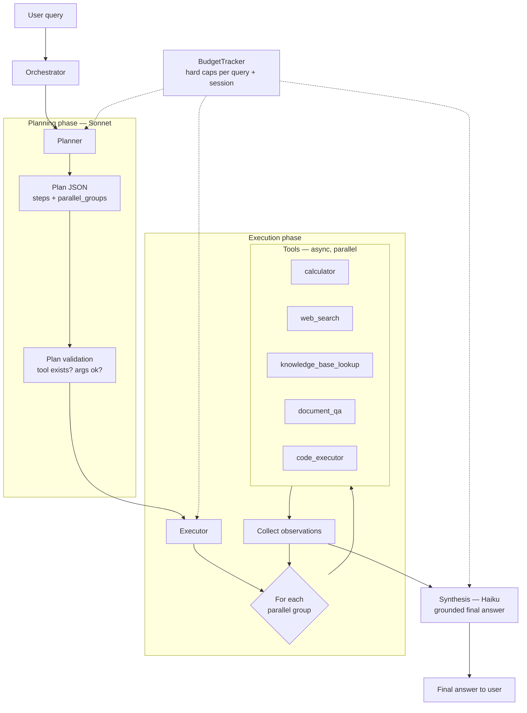
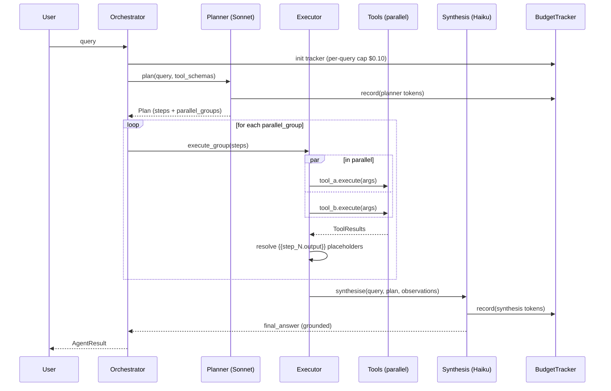

# Architecture

This document explains the design decisions behind this agent, the alternatives considered, and the trade-offs accepted. It is intentionally opinionated — each choice is justified by either a production concern, an eval signal, or a core design goal.

## System overview

## Query lifecycle

## Component map

| Module | Responsibility |
|---|---|
| `agent/config.py` | Env-var loading, model pricing, path setup. Single source of truth — no module calls `os.getenv()` directly. |
| `agent/budget.py` | Token + cost tracking, hard per-query and per-session caps, thread-safe for parallel tool calls. |
| `agent/prompts.py` | v1 (baseline) and v2 (structured) prompts for planner and executor. Single file = single-change ablation. |
| `agent/planner.py` | Query → structured JSON plan via Sonnet. JSON repair + retry on parse failure. Plan validation against tool registry. |
| `agent/executor.py` | Plan → observations. Parallel groups via `asyncio.gather`. Placeholder substitution. Per-step retry on failure. Final synthesis call. |
| `agent/orchestrator.py` | Top-level: plan → execute → structured `AgentResult`. Captures all exceptions into results rather than raising. |
| `tools/base.py` | `Tool` ABC + `ToolRegistry`. `ToolResult` always returned (never raised). |
| `tools/*.py` | Five concrete tools: calculator, web_search, knowledge_base_lookup, document_qa, code_executor. |
| `eval/queries.py` | 10 hand-designed evaluation queries with per-query rubrics. |
| `eval/judge.py` | LLM-as-judge (Haiku) producing structured `Judgment` with pass/fail + 0-1 score + reasoning. |
| `eval/runner.py` | Runs agent + judge over the query set, emits JSON result + per-capability aggregates. |
| `main.py` | CLI entry point. Human-readable or `--json` output. |

## Key design decisions (and rejected alternatives)

### 1. Explicit plan → execute → synthesise, not native tool-use loop

**Chosen:** Agent produces an explicit Plan JSON first, then the executor
runs it, then a synthesis call produces the final answer.

**Rejected:** Anthropic's native tool-use loop (pass `tools=[...]` to
`messages.create` and let the model call tools iteratively).

**Why:**
- A core design goal *"the agent states a plan before executing"*.
- Full trace visibility — every plan, every tool call, every observation
  is inspectable. Critical for debugging during the 48-hour build and
  for eval reproducibility.
- Ablation becomes surgical: we can swap the planner prompt without
  touching the executor, or vice versa. Native tool-use mixes these
  concerns.

**Trade-off:** Loses the model's ability to interleave reasoning and
tool calls mid-thought. Our plan is static once produced, so novel
information from an early tool call cannot prompt a plan change within
the same query (we'd need a reflection loop for that — see Roadmap).

### 2. Dual-model split — Sonnet for planning, Haiku for execution

**Chosen:** Sonnet for the planning call (high-stakes reasoning) and
synthesis call. Haiku for any repeat / high-volume calls.

**Rejected:** All-Sonnet (expensive) or all-Haiku (weaker plans).

**Why:** Plan quality dominates overall success — a bad plan cannot be
recovered by a good executor. Synthesis is also reasoning-heavy because
it has to interpret tool errors, partial failures, and ground claims.
Both use Sonnet. Haiku handles the cheaper judge calls in eval.

**Measured cost:** ~$0.013 per query mean in v2 baseline across 10
queries. Well inside the $0.10 per-query cap.

### 3. `ToolResult` always returned — tools never raise

**Chosen:** Every tool call returns a `ToolResult` dataclass with
`success: bool`, `output`, `error`, and `latency_ms`. Exceptions are
captured and wrapped.

**Rejected:** Raising exceptions from tool code.

**Why:** The agent needs to *reason over* tool failures (retry, pick
alternative, or give up gracefully). A raising tool would crash the
executor loop; a returning-failure tool lets the agent continue and
lets the synthesis LLM decide how to communicate the failure to the
user. This is the foundation of graceful-failure behaviour.

### 4. AST-based calculator, not `eval()`

**Chosen:** Whitelist-based AST evaluation (only arithmetic, math
functions, constants).

**Rejected:** `eval()` with sandboxing (weak), `numexpr` (extra
dependency), `sympy` (too heavy for this scope).

**Why:** Tool arguments come from the LLM and are therefore untrusted.
`eval()` on LLM-generated strings is an RCE vulnerability even inside
an agent. The whitelist enforces a hard boundary: no import statements,
no function definitions, no attribute access.

### 5. Subprocess-isolated code_executor with threat model disclosure

**Chosen:** Separate Python subprocess with `-I` isolated mode, import
blocklist for network modules, temp-dir workspace, output size cap, and
hard timeout.

**Rejected:** Inline `exec()`, Docker (adds deployment dependency),
gVisor/firecracker (out of scope for a 48h build).

**Why / honest limitations:** This is appropriate for the threat model
*"the LLM writes buggy code that could crash or hang the agent"*, not
*"an attacker tries to escape the sandbox"*. For the latter, kernel-
level isolation is needed. This is documented in the tool's docstring.
Production deployment should wrap this in a container.

### 6. Local embeddings (`all-MiniLM-L6-v2`) for document_qa

**Chosen:** `sentence-transformers/all-MiniLM-L6-v2` (22MB, runs on
MPS/CPU locally), ChromaDB persistent client.

**Rejected:** OpenAI `text-embedding-3-small` (better quality, but adds
API cost and external dependency), BM25-only (weaker for semantic
queries), rerank-after-BM25 (more complex, marginal gain at this scale).

**Why:** No API cost, no rate limits, reproducible, fast enough
(embedding 639 chunks took ~8s on the M4). For the 3-document test
corpus this is adequate. At 10,000+ documents we'd revisit the choice.

### 7. Fixed-size chunking (500 chars, 50-char overlap) with boundary-aware breaks

**Chosen:** Fixed-size character chunks with overlap, preferring
paragraph/sentence breaks within the window.

**Rejected:** Pure fixed-size (breaks mid-word), semantic chunking via
sentence embeddings (complex, slow to iterate on), full-document
embedding (loses granularity).

**Why:** Simple, deterministic, cheap to reason about during a 48-hour
build. Honestly documented as a trade-off — semantic chunking would
likely improve retrieval quality by 10-20% but wasn't worth the build
complexity here.

### 8. LLM-as-judge with structured JSON output

**Chosen:** Haiku at `temperature=0`, structured system prompt
enforcing JSON-only output, per-query rubric injected into user message.

**Rejected:** Exact substring matching (too brittle for natural-language
answers), regex rubrics (brittle + hard to maintain), human grading
(not reproducible at eval-harness scale).

**Why:** ~40% of the eval queries have non-deterministic correct
answers (prices change, natural-language explanations vary). The judge
allows nuanced grading — including partial credit for answers that are
"correct math but hallucinated a side fact" (see Q10 smoke-test
behaviour). Per-query cost ~$0.003.

## Concurrency model

- **Within a single agent run:** `asyncio` for all I/O — tool calls run
  concurrently when a `parallel_group` contains multiple steps.
  Semaphore caps concurrency at `MAX_PARALLEL_TOOLS` (default 5).
- **Across runs:** Each `Orchestrator.run()` call is independent;
  `BudgetTracker` is per-run but a global session counter is shared
  across instances (thread-safe via `threading.Lock`).
- **Tool-level:** `asyncio.wait_for` enforces a per-tool timeout so a
  single hung tool cannot block an entire query.

See the Report for a full "what breaks at 100 concurrent users" analysis.

## Failure handling — layered

| Failure class | Where handled | Response |
|---|---|---|
| Malformed LLM JSON (planner) | `_repair_json()` + retry with stricter prompt | Repair → parse → validate. Fails hard after 2 attempts. |
| Invalid tool name in plan | Plan validation | `PlannerError` — orchestrator converts to `success=False` result. |
| Tool raises exception | `Tool.execute()` base class | Wrapped in `ToolResult(success=False)`. Executor retries once. |
| Tool timeout | `asyncio.wait_for` in base class | Same as above — `ToolResult(success=False, error="timeout")`. |
| Budget exceeded | `BudgetTracker.record()` pre- and post-hoc | Raises `BudgetExceededError`. Orchestrator captures and returns. |
| Synthesis LLM hallucinates | v2 prompt's grounding rule + judge catches in eval | Partial credit in judge score; documented failure mode. |

## Scaling analysis — what breaks at 100 concurrent users?

A candid analysis of the current architecture under concurrent load. The
answer is not "it breaks" or "it scales fine" — different bottlenecks
dominate at different scales. I break them into four categories: things
that break fast, things that degrade gracefully, things that already scale,
and things that require design changes.

### Breaks fast (first failure modes, <100 concurrent)

**Anthropic API rate limits.** At tier-2 pricing, the account I'm using has
roughly 4,000 requests per minute across Sonnet and Haiku combined. At 100
concurrent users with ~2 LLM calls per query (planner + synthesis), that's
~200 req/query × concurrent rate. If all 100 users fire queries within the
same minute, we hit the RPM ceiling, and 429s start cascading. Every
blocked request raises `anthropic.RateLimitError` which the current code
does not catch — it propagates through `Orchestrator.run()` into
`AgentResult(success=False)`. The user sees a hard failure.

*Fix:* Wrap Anthropic calls with tenacity-style retry-with-jitter on 429,
expose per-model QPS limits via a token-bucket middleware, and upgrade to
tier-4 billing which raises the cap. Realistic ceiling even with fixes:
single-region API has known upper bounds.

**ChromaDB PersistentClient is single-process.** Document_qa uses
`chromadb.PersistentClient(path=...)` which opens a SQLite-backed local
store. Multiple agent workers on the same host can share it, but at 100
concurrent queries the SQLite write lock becomes a contention point
during ingestion operations. Read concurrency is fine (multiple readers).

*Fix:* Switch to Chroma in server mode (runs as a separate service), or
use a hosted vector DB (Pinecone, Weaviate) for multi-process writes.

**Embedding model in-process.** The agent loads `all-MiniLM-L6-v2`
(~22MB model + ~500MB PyTorch state) into each worker process. 100
concurrent workers = 50GB of RAM just for the embedding model. This
doesn't fit on anything short of a dedicated GPU box.

*Fix:* Extract embeddings into a dedicated service (e.g., Triton, TGI)
that worker processes call over HTTP. The agent process stays small;
embedding compute is centralised.

### Degrades gracefully (workable at 100 concurrent)

**Tool latency.** Web_search (Tavily) takes 1-3 seconds. At 100
concurrent users, Tavily's rate limits (free tier: 1000 req/month) are
the first wall — not our concurrency model. The agent's `asyncio`-based
parallel execution means 100 queries each running ~3 tools in parallel
is 300 in-flight HTTP calls. This is fine from `asyncio`'s perspective
(it's designed for exactly this), but each worker process needs its
connection pool sized appropriately (`aiohttp` default is 100; bump
to 500+).

**Budget tracking.** The global session counter uses `threading.Lock`.
Per-query budget is local to each `Orchestrator.run()` call and fully
independent. Lock contention is negligible at 100 concurrent writers
to a single counter. Python's GIL means the arithmetic itself is
serialised, but one atomic add per API call is nowhere near a bottleneck.

### Already scales

**Calculator, code_executor, knowledge_base_lookup.** These are
pure-Python or subprocess-local. No shared resources, no external
APIs, no network dependencies. They scale linearly with CPU cores.

**Plan validation, placeholder substitution.** All in-memory, no I/O,
microseconds per operation.

### Requires design changes (>100 concurrent, toward 1,000+)

**No request queue or admission control.** Currently, `Orchestrator.run()`
is called directly and runs immediately. Under overload, new requests
compete for the same API quota as in-flight requests, causing everyone
to slow down equally. A production deployment needs a queue
(Redis/RabbitMQ) with per-tenant rate limiting and drop-on-overload
policy.

**No circuit breakers on external APIs.** If Tavily goes down, every
web_search call waits the full timeout (20s) before failing. At 100
concurrent users, that's 100 workers blocked for 20s each. Circuit
breakers (e.g., `aiobreaker`) would fail fast after N failures.

**ChromaDB as a single point of failure.** Even in server mode, a
single Chroma instance serving 100+ concurrent queries becomes the
bottleneck. Real deployments need sharded vector stores with read
replicas.

**Observability gap.** At 100 concurrent users, log-based debugging
stops being viable. Need distributed tracing (OpenTelemetry), metrics
backend (Prometheus), and structured logging with correlation IDs.
The current architecture logs to files — fine for 1-10 users, useless
at scale.

### Summary of the 100-concurrent-user threat model

| Bottleneck | Severity | Fix effort |
|---|---|---|
| Anthropic RPM limits | **High** — causes hard failures | Medium: retry logic + tier upgrade |
| Embedding model RAM | **High** — infeasible without extraction | High: embeddings as a service |
| ChromaDB write contention | Medium — slows ingestion | Medium: switch to server mode |
| aiohttp connection pool sizing | Medium — silent slowdown | Low: config change |
| No request queue | Medium — no backpressure | Medium: add queue + rate limiter |
| No circuit breakers | Low-medium — fail-slow on outages | Low: library wrapper |
| Observability | Low short-term, high long-term | Medium: OTel integration |

The honest answer: **the current architecture is designed for single-user
interactive use and would start failing between 20-50 concurrent users
without modification.** Each failure mode above has a known fix; none
require architectural redesign. The order of fixes would be
(1) API retry + token bucket, (2) embedding service extraction,
(3) request queue, (4) observability, (5) everything else.

## What this architecture does NOT provide

Listed honestly so the reader can evaluate fitness for their use case:

- **No reflection loop.** If execution fails, the agent does not re-plan.
  `MAX_ITERATIONS` is enforced but current code always breaks after iter 1.
  Adding reflection is in the Roadmap.
- **No cross-session memory.** Each query starts fresh — no long-term
  context, no user preferences, no learned tool affinities.
- **No per-tenant isolation.** One process, one shared ChromaDB, one
  shared KB file. Multi-tenant deployment needs a workspace abstraction.
- **No streaming output.** Synthesis is a single non-streaming call;
  the user waits for the full answer. For long responses, streaming
  would improve perceived latency.
- **No observability beyond logs + SQLite run records.** Production
  deployment would want OpenTelemetry traces, a metrics backend, and
  an LLM-call audit log.